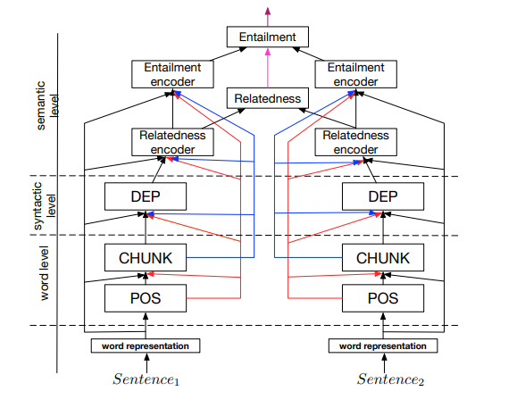

# Paper Reading List
This is my paper reading list for future reference.

## Question Answering
**Read + Verify: Machine Reading Comprehension with Unanswerable Questions**
[https://arxiv.org/pdf/1808.05759.pdf](https://arxiv.org/pdf/1808.05759.pdf)
- Author: [NUDT, MSRA 2018]  
Minghao Hu, Furu Wei, Yuxing Peng, Zhen Huang, Nan Yang, Ming Zhou
- Abstract:
[Model Picture](fig/Selection_004.png)  

**U-Net: Machine Reading Comprehension with Unanswerable Questions**  
[https://arxiv.org/pdf/1810.06638.pdf](https://arxiv.org/pdf/1810.06638.pdf)
- Author: [Fudan, Liulishuo 2018]  
Fu Sun, Linyang Li, Xipeng Qiu, Yang Liu
- Abstract:
[Model Picture](fig/Selection_009.png)

**Simple and Effective Multi-Paragraph Reading Comprehension**  
*Document-qa Model*  
[https://arxiv.org/pdf/1710.10723.pdf](https://arxiv.org/pdf/1710.10723.pdf)
- Author: [UW, Allen-AI 2017]  
Christopher Clark, Matt Gardner
- Abstract:
[Model Picture](fig/Selection_005.png)

**Stochastic Answer Networks for Machine Reading Comprehension**  
*SAN Model*  
[https://arxiv.org/pdf/1712.03556.pdf](https://arxiv.org/pdf/1712.03556.pdf)
- Author: [Microsoft US， JHU 2018]  
Xiaodong Liu, Yelong Shen, Kevin Duh, Jianfeng Gao
- Abstract:
[Model Picture](fig/Selection_006.png)

**FUSIONNET: FUSING VIA FULLY-AWARE ATTENTION WITH APPLICATION TO MACHINE COMPREHENSION**
[https://arxiv.org/pdf/1711.07341.pdf](https://arxiv.org/pdf/1711.07341.pdf)
- Author: [Microsoft Taiwan 2018]  

- Abstract:
[Model Picture](fig/Selection_007.png)  

**Reinforced Mnemonic Reader for Machine Reading Comprehension**  
[https://arxiv.org/pdf/1705.02798.pdf](https://arxiv.org/pdf/1705.02798.pdf)
- Author: [NUDT, FuDan 2018]  
Minghao Hu, Yuxing Peng, Zhen Huang, Xipeng Qiu, Furu Wei, Ming Zhou
- Abstract:
[Model Picture](fig/Selection_008.png)  

**Bidirectional Attention Flow for Machine Comprehension**  
[https://arxiv.org/pdf/1611.01603.pdf](https://arxiv.org/pdf/1611.01603.pdf)

- Author: [UW, Allen-AI]  
Minjoon Seo, Aniruddha Kembhavi, Ali Farhadi, Hannaneh Hajishirzi
- Abstract:
[Model Picture](fig/Selection_010.png)

## Multitask Learning
**The Natural Language Decathlon: Multitask Learning as Question Answering**  
[https://arxiv.org/pdf/1806.08730.pdf](https://arxiv.org/pdf/1806.08730.pdf)
- Author:  [Salesforce 2018]  
    Bryan McCann, Nitish Shirish Keskar, Caiming Xiong, Richard Socher
- Abstract：  
    We introduce the Natural Language Decathlon (decaNLP), a challenge that spans ten tasks: question answering, machine translation, summarization, natural language inference, sentiment analysis, semantic role labeling, relation extraction, goal-oriented dialogue, semantic parsing, and commonsense pronoun resolution. We cast all tasks as question answering over a context. Furthermore, we present a new multitask question answering network (MQAN) that jointly learns all tasks in decaNLP without any task-specific modules or parameters.

**A Unified Architecture for Natural Language Processing: Deep Neural Networks with Multitask Learning**   
[https://ronan.collobert.com/pub/matos/2008_nlp_icml.pdf](https://ronan.collobert.com/pub/matos/2008_nlp_icml.pdf)
- Author: [NEC Labs 2008 ICML]  
    Ronan Collobert, Jason Weston 
- Abstract:  
    We describe a single convolutional neural network architecture that, given a sentence, outputs a host of language processing predictions: part-of-speech tags, chunks, named entity tags, semantic roles, semantically similar words and the likelihood that the sentence makes sense (grammatically and semantically) using a language model. The entire network is trained jointly on all these tasks using weight-sharing, an instance of multitask learning.

**A Joint Many-Task Model:Growing a Neural Network for Multiple NLP Tasks**   
[https://arxiv.org/pdf/1611.01587.pdf](https://arxiv.org/pdf/1611.01587.pdf)

- Author: [The University of Tokyo, Salesforce Research 2016]  
Kazuma Hashimoto, Caiming Xiong, Yoshimasa Tsuruoka, Richard Socher
- Abstract:

**Multi-task sequence to sequence learning.**   
[https://arxiv.org/pdf/1511.06114.pdf](https://arxiv.org/pdf/1511.06114.pdf)

- Author: [Google Brain 2016]  
Minh-Thang Luong, Quoc V. Le, Ilya Sutskever, Oriol Vinyals, Lukasz Kaiser
- Abstract:  
This paper examines three multi-task learning (MTL) settings for sequence to sequence models: 
    - (a) the oneto-many setting – where the encoder is shared between several tasks such as machine translation and syntactic parsing
    - (b) the many-to-one setting – useful when only the decoder can be shared, as in the case of translation and image caption generation
    - (c) the many-to-many setting – where multiple encoders and decoders
are shared, which is the case with unsupervised objectives and translation.

**Adding multiple tasks to a single network by iterative pruning**   
[https://arxiv.org/pdf/1711.05769.pdf](https://arxiv.org/pdf/1711.05769.pdf)

- Author: [UIUC 2018]  
Arun Mallya, Svetlana Lazebnik
- Abstract:  
This paper presents a method for adding multiple tasks to a single deep neural network while avoiding catastrophic forgetting. Inspired by network pruning techniques, we exploit redundancies in large deep networks to free up parameters that can then be employed to learn new tasks. By performing iterative pruning and network re-training, we are able to sequentially “pack” multiple tasks into a single network while ensuring minimal drop in performance and minimal storage overhead. Unlike prior work that uses proxy losses to maintain accuracy on older tasks, we always optimize for the task at hand.

**Multi-reward reinforced summarization with saliency and entailment.**  
[https://arxiv.org/pdf/1804.06451.pdf](https://arxiv.org/pdf/1804.06451.pdf)

- Author: []  

- Abstract:

**Glue: A multi-task benchmark and analysis platform for natural language understanding.**   
[https://arxiv.org/pdf/1804.07461.pdf](https://arxiv.org/pdf/1804.07461.pdf)

- Author: []  

- Abstract:

**Google’s multilingual neural machine translation system: Enabling zero-shot translation.**
[https://arxiv.org/pdf/1611.04558.pdf](https://arxiv.org/pdf/1611.04558.pdf)

- Author: []  

- Abstract:

## Entity Linking

- Author: []  

- Abstract: